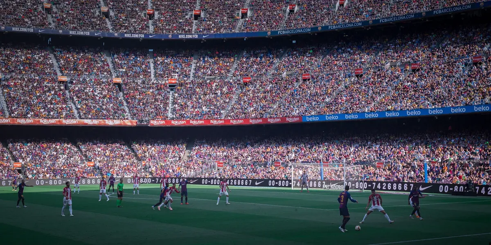
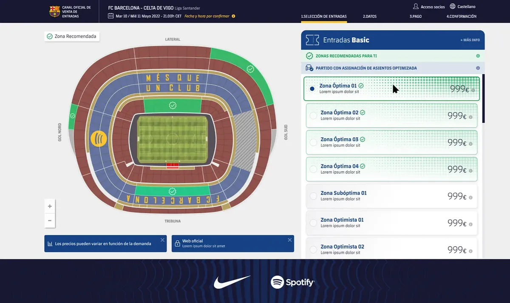
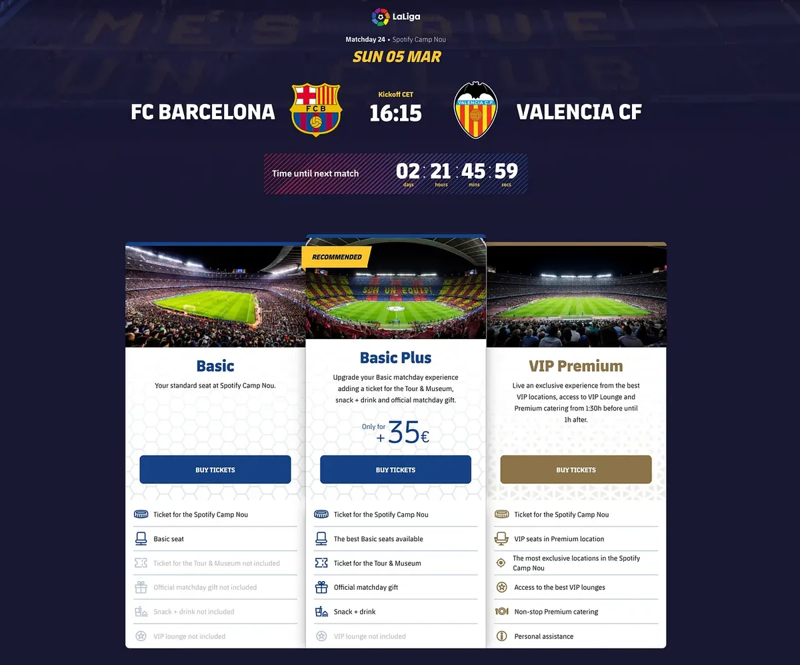
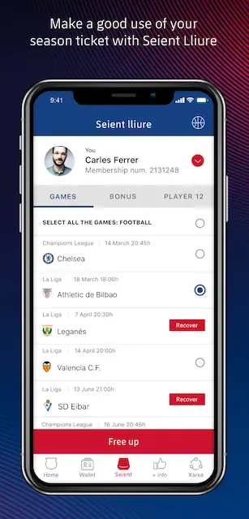
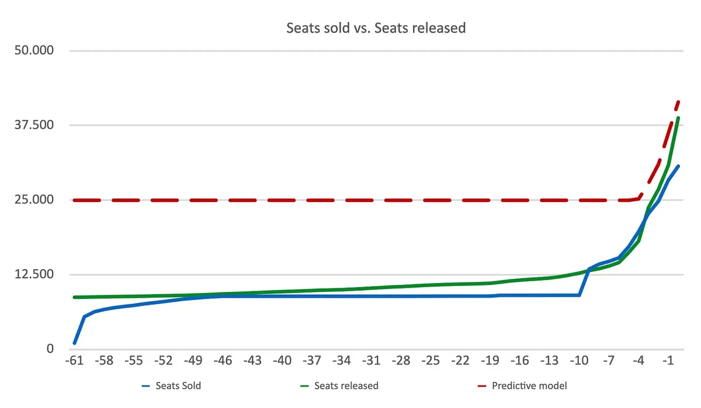

# Data Science at Camp Nou

*December 2022*

One of our core activities at **FC Barcelona**'s Venue Business department is selling match day and season tickets to football matches at **Spotify Camp Nou**. We operate in a highly dynamic and complex space, with multiple economic, social and political constraints. As in every business, targets move, but overall our goal is optimizing for match day revenue and fan experience, always keeping a baseline attendance. Mission-wise, we strive to give fans an unforgettable **stadium experience** and players the best possible **match atmosphere**, while maximizing **ticketing revenue** per match.

<em>Fig. 1: An aerial view of Spotify Camp Nou on a match day</em>

Working at FC Barcelona is exciting because it's one of the largest brands in football, with both strong values and a worldwide recognized playing style that go [beyond the pitch](https://www.youtube.com/watch?v=yyqnd1uNvI0). Specifically, working at Ticketing is great since the data available is rich and the data culture is continually growing. Analytical thinking is emphasized from the top-down, and the spirit is relying less on intuition and trying to support decisions with data and statistics.

The motivation for this article is sharing from my perspective how we approach **data science & analytics** challenges at Ticketing, how the team is organized, the way we prioritize our tasks, and what it means for us to succeed – conceptually but also illustrating with real-world examples of fan-faced problems we have tackled. After sharing my thoughts – as a form of reflection of my last 5 years at the company – I will close by mentioning some projects that excite us about the future.

---

## Team structure

We are a small multidisciplinary team of product managers, project managers, developers, designers, user researchers, ops, and **data scientists/analysts**, and we collaborate closely on many projects. On the one hand, data scientists/analysts do not work in isolation but in a **business** context and have enough product and business sense to navigate in the problem space and ask the right questions. On the other hand, even though we work together and aligned towards common roadmaps and targets, data scientists/analysts have internal customers; there is a need at the company to exploit the data we have, especially around understanding our **fans** and their behaviors, and also in building tools for other teams internally.

<em>Fig. 2: Match day at Spotify Camp Nou from field perspective</em>

Skills-wise, **data scientists/analysts** are creative problem solvers who not only have analytical skills but also understand how and when to use them. They need to be humble about what data can tell, trying to stay objective and out of their own mindset when needed. Because of the low **data-to-business people ratio**, the team is made up of independent workers who have a systematic approach to vague questions; sometimes they might act end-to-end without external support. At a collaborative and relatively small organization like FC Barcelona, they also need to know how to **communicate** – not just having tech expertise but also the ability to interact with other people is a key aspect. In that sense, they also act as translators to a broad group of people. Technical abilities are clearly important, but ultimately their goal is to influence and persuade other employees of the organization to act in accordance with product insights.

---

## Output

We mainly output three things as a team:

1. Analytics
2. Experimentation
3. Predictive Modeling

In the next sections, I will dive into and try to illustrate each output with examples. Key to these success stories is our partnership with **local agencies** who understand our business deeply, know the subtleties of the market we operate in, and most importantly have the knowledge to act in it.

---

## 1. Analytics

The focus of **data analysts** is to extract knowledge from the way fans interact with our digital products and trying to make sense of the data that we gather – then presenting an argument to convince the organization to make the right strategic **decisions**.

Product sense is essential for this task: the capacity to see issues from our fans' and other stakeholders' viewpoints, to choose the right **KPIs** for evaluating solutions, and to discover the right problems to tackle. It involves collaborating directly with the product managers, working together in optimizing metrics to grow the **business**. They frequently guide product owners on questions such as how well a feature launch or marketing action is doing, how a specific country is performing, or how tourism is affecting the business.

Being a data analyst on the product side also means creating a **framework** and analyzing results to influence next product decisions, and working on different inference methods when A/B testing is not possible. It means less building and more demonstrating the ability to communicate and influence effectively through data.

### Practical example: RecZones

RecZones is a **data-driven feature** integrated into the online purchase process that estimates users' budget and maps it to recommended areas in the stadium.

<em>Fig. 3: UX prototype of recommended areas predicted by the model</em>

In this example, data analysts formulated the core questions and hypotheses to validate:

- How does the UX impact conversion rates along the purchase funnel?
- How are users interacting with RecZones on an aggregate level – and by platform, device, country?
- What are the main metrics we are trying to improve? Are there secondary metrics to be aware of?
- Is the model affecting performance such as page load time?
- Are users happy with the recommendations, and is there a feedback loop in place?
- Perhaps another look & feel improves user interaction – should we A/B test?
- Are users interacting more with the map or the areas list? Does this differ on mobile vs desktop?

---

## 2. Experimentation

Experimentation is a key element in our development cycle and an effective approach toward product innovation. Making data-driven product decisions means **testing** and validating **hypotheses** continuously. We have weekly meetings where product managers – and basically anyone who wants to – can attend. Each business unit presents results from an **A/B test** or new ideas, which are discussed publicly and can serve as inspiration for other teams.

In the last years, we have developed a healthy culture of experimentation and a common mindset toward decision-making and exploring new ideas. This applies to plain, low-risk experiments but also extends to more complex ones involving predictive modeling and algorithms.

Our **testing workflow** consists of four stages, which happen mostly in parallel:

> Hypothesis Generation → Pre-test Analysis → Live Testing → Post-test Analysis

We focus on defining the right [OEC](https://www.linkedin.com/pulse/overall-evaluation-criterion-oec-ronny-kohavi/) (Overall Evaluation Criterion) for each experiment and on maintaining a smart tests portfolio – striving for the right **risk/reward** balance and seeking **global optimums**. There are three main benefits we get from experimenting:

1. **Winning tests** – statistically significant results that help revenue go to production; those that hurt get discarded
2. **Cost savings** – testing is cheaper than developing in production; inconclusive tests can be discarded without sunk cost
3. **Fan understanding** – testing is a form of user research that can be leveraged in future experiments or product decisions

### Practical example: Match Landing Page

The match landing page is a key web asset in the customer journey of ticket buyers. It displays the competition and venue, date and time, opponent team, countdown, benefits of buying online, and the products podium.

<em>Fig. 4: Ticketing landing page for a home match against Valencia</em>

This is an example of an asset reaching a local optimum through optimization – we are at a point of repeating previous tests to see if they stand the test of time. We have played with the layout by removing, relocating, and resizing elements; with different product naming and CTAs; adding pricing and accelerators; optimizing for mobile performance; among a hundred other tweaks. Most importantly, we have always defined clear primary and secondary **metrics** to evaluate success before moving on.

From a business perspective, having this landing page fully optimized makes a significant contribution to incremental tickets sold per match, especially non-basic tickets.

---

## 3. Predictive modeling

Luckily, we have a large number of interactions and attributes of our fans engaging with our products. Before framing an idea as a **machine learning** problem, we think about what is technically possible and what matters for the business. We aim to build models that are both predictive and interpretable, seeking different balances between **predictive power** and **interpretability** depending on the problem.

The common theme: take a domain question and ask – *how can I convert this to a prediction task? Can this be done algorithmically?*

Once we have a clear machine learning problem defined, we follow a workflow (outlined linearly for simplicity, but which works iteratively in reality):

> Scoping → Data Exploration → Feature Engineering → Model Design → Prototype Analysis → Productionization → Maintenance

We tend to start with simple models and iterate from there. If time allows, we prioritize interpretability above accuracy in early stages and return to more complex models once we have gained as much knowledge as possible. During all phases, we rely heavily on a **collaborative** environment where we can show our approach to someone and get honest, constructive feedback.

### Practical example: SmartBooking

With a capacity of 99,354, Spotify Camp Nou is the biggest stadium in Europe. Around 85,000 of those seats are owned by members for the entire season, and a significant number frequently don't attend matches for various reasons. To avoid empty seats on match day, the club has an official system called **Seient Lliure** – a platform for members to release their seat and recover a percentage of its face value. A member can decide to release her/his seat at any point before match kick-off, and that seat becomes available for the club to sell to the general public.

<em>Fig. 5: Screenshot of the Seient Lliure app as featured on the App Store</em>

On average, **~40% of seats** for matches at Spotify Camp Nou are released in the last 72 hours before the match. This creates several negative consequences:

- At the time a match goes on sale, there are hardly any releases, so there are hardly any tickets available – and it's highly unlikely to find seats in pairs, while competing secondary ticketing sites do offer paired seats for the same match
- Match after match, a high number of unsold seats remain, showing an inconsistency between real demand and final attendance
- Especially for second-half-of-season matches, hardly any seats become available until 2–3 days before kick-off

**SmartBooking** was conceived to solve these problems and was a disruptive change in the ticket sales purchase process, [initially implemented in the 2018/19 season](https://www.fcbarcelona.com/en/news/981315/fc-barcelona-promotes-an-intelligent-ticket-sales-model).

<em>Fig. 6: A simplified graph explaining the problem SmartBooking solves</em>

With SmartBooking, users do not select seats but an **area of the stadium** instead, and the club allocates seats in that area a few days before the match.

At its core, a **prediction model** for "tickets available to sell" was built based on *Seient Lliure* predictions for each area of the stadium across different time horizons (72, 48, 24, and 0 hours before the match), using features that characterize: match (day, competition, date and time), rival (historical and current ELO score, record, special rivalry, etc.), stadium areas, holidays, and more.

Business results: on average **10% more tickets sold per season**, plus a **40% increase in average ticket value**, as a consequence of:

- Maximizing ticket sales through availability **forecasting** – possible to sell tickets in advance regardless of when members release them
- Enabling **dynamic pricing** strategies due to a higher commercialization timespan

> **Code companion:** [dynamic-pricing](https://github.com/0trm/dynamic-pricing) is a public re-implementation of a ticket-pricing engine of this kind, on synthetic data: a demand forecast per match and seating zone, a revenue-maximising price search, and a human approval step, with its evaluation reproducible from the repo.
- Unlocking **cross & up-selling** and new sales channels (via APIs) by bridging native outdated systems

---

## Measuring success

For practical things, there are obvious measures: **product KPIs, conversion rates, and experimentation metrics**. What becomes harder is the qualitative aspect – the perceived value contributed as a team. Having data, a success metric, and a model is not enough; we also need feedback from our stakeholders to make sure we are making a real impact.

For **predictive modeling**, we monitor how successful the model is in aggregate over time, measured by how the organization internally views its usefulness: Are they using it? Do they trust it? Are they asking for improvements? Are they engaged and coming up with new ideas? These are harder to quantify but still useful for a sanity check.

For **product analytics**, we look at soft metrics such as whether we are changing the behavior of internal clients and actually affecting their decisions – and how those decisions translate into business impact. For **experimentation**, it's fairly straightforward: when we get statistically significant results impacting revenue, conversion rate, transactions, or other relevant metrics, the data speaks for itself.

---

## Future

The last years have been challenging and fun, as we've been very focused on increasing the quality of the overall ticketing experience through **product analytics**, as well as working closely with product teams to test hypotheses, identify new opportunities, and respond to feedback from fans and stakeholders.

I am optimistic about how far data literacy has come at the organization and what the future holds. There are truly exciting Ticketing **digital projects and products** where data will play a relevant role:

- **Barça eTicket** – the digitalization of tickets to Spotify Camp Nou, allowing fans to access the venue through a new official stadium mobile app; this will unlock a broad set of commercial possibilities while effectively fighting fraud
- **Barça ID** – each eTicket will be linked to a unique fan digital profile/account, making it fascinating to explore the diversity of our fans by adding new dimensions
- [**Espai Barça**](https://espaibarca.fcbarcelona.com/en/) – a huge and ambitious project set to transform the FC Barcelona venue and stadium

I hope this gives you insight into applied product analytics at Spotify Camp Nou's ticketing, and the variety of problems we get to solve daily. We are a team driven by our passion for the business and our excitement to be leaders in the **sports industry**.

Personally, I really enjoy trying to understand things through data, reframing a business problem and applying analytical thinking to solve it. I am particularly looking forward to seeing how data will impact many industries, and I am thrilled to be a part of that future.

---

*Disclaimer: The views and opinions expressed in this publication are those of the author and do not necessarily reflect the views or positions of any entities he represents.*
